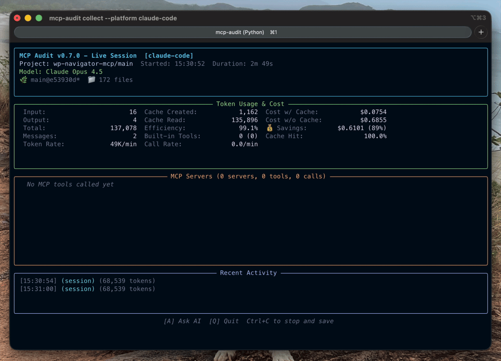

# MCP Audit

**MCP tools eating context and you don't know which ones?**

Whether you're building MCP servers or using them daily, mcp-audit shows you exactly where tokens go—per server, per tool, in real-time.

[](https://pypi.org/project/mcp-audit/)
[](https://pypi.org/project/mcp-audit/)
[](https://pypi.org/project/mcp-audit/)
[](https://github.com/littlebearapps/mcp-audit/actions/workflows/ci.yml)
[](https://github.com/littlebearapps/mcp-audit/actions/workflows/codeql.yml)
[](https://opensource.org/licenses/MIT)

<!-- TODO: Add hero image or GIF showing the TUI in action -->
<!--  -->

| Track | Break Down | Optimize |
|-------|------------|----------|
| Watch tokens flow in real-time | See it by server, then by tool | Tune your tools—or pick better ones |

```bash
pip install mcp-audit
```

---

## Who Is This For?

**MCP Tool Developers**
You built an MCP server (hand-coded or via Claude/Codex). Now you need to know: how efficient are your tools? Which ones bloat context? mcp-audit gives you per-tool token metrics so you can optimize before shipping.

**AI Coding Power Users**
You use Claude Code, Codex CLI, or Gemini CLI daily. You've hit context limits or seen costs spike. mcp-audit breaks down exactly which MCP servers and tools are responsible.

---

## Quick Start

### 1. Track a Session

```bash
# Track Claude Code session
mcp-audit collect --platform claude-code

# Track Codex CLI session
mcp-audit collect --platform codex-cli

# Track Gemini CLI session (requires telemetry enabled)
mcp-audit collect --platform gemini-cli
```

Sessions are automatically saved to `~/.mcp-audit/sessions/`.

### 2. Generate a Report

```bash
# View summary of all sessions
mcp-audit report ~/.mcp-audit/sessions/

# Export detailed CSV
mcp-audit report ~/.mcp-audit/sessions/ --format csv --output report.csv

# Generate markdown report
mcp-audit report ~/.mcp-audit/sessions/ --format markdown --output report.md
```

### 3. Review Results

```
Top 10 Most Expensive Tools (Total Tokens)
═══════════════════════════════════════════════════════════════
Tool                              Calls    Tokens    Avg/Call
mcp__zen__thinkdeep                  12   450,231      37,519
mcp__brave-search__web               45   123,456       2,743
mcp__zen__chat                       89    98,765       1,109

Estimated Total Cost: $2.34 (across 15 sessions)
```

---

## Platform Support

| Platform | Status | Token Tracking | Time Tracking | Latency |
|----------|--------|----------------|---------------|---------|
| Claude Code | **Stable** | Yes | Yes | No |
| Codex CLI | **Stable** | Yes | Yes | No |
| Gemini CLI | **Stable** | Yes | Yes | Yes |
| Ollama CLI | Experimental | No* | Yes | Yes |

*Ollama runs locally without token costs; time-based tracking available.

---

## Features

### Real-Time Tracking

Monitor your session as you work:

```bash
mcp-audit collect --platform claude-code
```

```
MCP Audit - Live Session
━━━━━━━━━━━━━━━━━━━━━━━━━━━━━━━━━━━━━

Tokens:  45,231 input │ 12,543 output │ 125K cached
Cost:    $0.12 (estimated)
Tools:   42 calls │ 12 unique

Recent: mcp__zen__chat (3,421 tokens)
```

### Cross-Session Analysis

Aggregate insights across all your sessions:

```bash
mcp-audit report ~/.mcp-audit/sessions/ --aggregate
```

- Top expensive tools by total tokens
- Most frequently called tools
- Anomaly detection (high variance, duplicates)
- Per-server cost breakdowns

### Duplicate Detection

Automatically identifies redundant tool calls:

```json
{
  "redundancy_analysis": {
    "duplicate_calls": 3,
    "potential_savings": 15234,
    "details": [
      {"tool": "mcp__brave-search__web", "count": 2, "tokens": 8765}
    ]
  }
}
```

### Privacy-First Design

- **No prompts stored** - Only token counts and tool names
- **Local-only** - All data stays on your machine
- **Redaction hooks** - Customize what gets logged

---

## Configuration

Create `~/.mcp-audit/config/mcp-audit.toml`:

```toml
[pricing.claude]
"claude-sonnet-4" = { input = 3.00, output = 15.00 }
"claude-opus-4" = { input = 15.00, output = 75.00 }

[pricing.openai]
"gpt-4o" = { input = 2.50, output = 10.00 }

[pricing.gemini]
"gemini-2.5-pro" = { input = 1.25, output = 10.00, cache_read = 0.3125 }
"gemini-2.5-flash" = { input = 0.075, output = 0.30 }
```

See [Pricing Configuration](docs/PRICING-CONFIGURATION.md) for details.

---

## Documentation

| Document | Description |
|----------|-------------|
| [Architecture](docs/architecture.md) | System design, data model, adapters |
| [Data Contract](docs/data-contract.md) | Backward compatibility guarantees |
| [Platforms: Claude Code](docs/platforms/claude-code.md) | Claude Code setup guide |
| [Platforms: Codex CLI](docs/platforms/codex-cli.md) | Codex CLI setup guide |
| [Platforms: Gemini CLI](docs/platforms/gemini-cli.md) | Gemini CLI setup guide |
| [Contributing](docs/contributing.md) | How to add platform adapters |
| [Privacy & Security](docs/privacy-security.md) | Data handling policies |

---

## CLI Reference

```bash
mcp-audit --help

Commands:
  collect   Track a live session
  report    Generate usage report

Options:
  --version  Show version
  --help     Show help
```

### collect

```bash
mcp-audit collect [OPTIONS]

Options:
  --platform          Platform to track (claude-code, codex-cli, gemini-cli, auto)
  --project TEXT      Project name (auto-detected from directory)
  --output PATH       Output directory (default: logs/sessions)
  --tui               Use rich TUI display (default when TTY available)
  --plain             Use plain text output (for CI/logs)
  --quiet             Suppress all display output (logs only)
  --refresh-rate NUM  TUI refresh rate in seconds (default: 0.5)
  --no-logs           Skip writing logs to disk (real-time display only)
```

#### Display Modes

MCP Audit automatically detects whether you're running in a terminal (TTY) and chooses the best display mode:

- **TUI mode** (default for terminals): Beautiful Rich-based dashboard with live updating
- **Plain mode** (default for CI/pipes): Simple scrolling text output
- **Quiet mode**: No display output, only writes logs to disk

### report

```bash
mcp-audit report [OPTIONS] SESSION_DIR

Arguments:
  SESSION_DIR        Session directory or parent directory containing sessions

Options:
  --format           Output format: json, csv, markdown (default: markdown)
  --output PATH      Output file (default: stdout)
  --aggregate        Aggregate data across multiple sessions
  --top-n INT        Number of top tools to show (default: 10)
```

---

## Data Storage

Sessions are stored at `~/.mcp-audit/sessions/`:

```
~/.mcp-audit/sessions/
├── claude_code/
│   └── 2025-11-25/
│       └── session-20251125T103045-abc123.jsonl
├── codex_cli/
│   └── 2025-11-25/
│       └── session-20251125T143022-def456.jsonl
└── gemini_cli/
    └── 2025-11-25/
        └── session-20251125T160530-ghi789.jsonl
```

Each session is a JSONL file (one event per line) for efficient streaming.

---

## Contributing

We welcome contributions! See [CONTRIBUTING.md](CONTRIBUTING.md) for:

- How to add new platform adapters
- Testing requirements
- PR workflow

### Development Setup

```bash
git clone https://github.com/littlebearapps/mcp-audit.git
cd mcp-audit
python -m venv venv
source venv/bin/activate
pip install -e ".[dev]"
pytest
```

---

## License

MIT License - see [LICENSE](LICENSE) for details.

---

## Links

- [GitHub Repository](https://github.com/littlebearapps/mcp-audit)
- [Issue Tracker](https://github.com/littlebearapps/mcp-audit/issues)
- [Changelog](CHANGELOG.md)

---

**Made with care by [Little Bear Apps](https://littlebearapps.com)**
